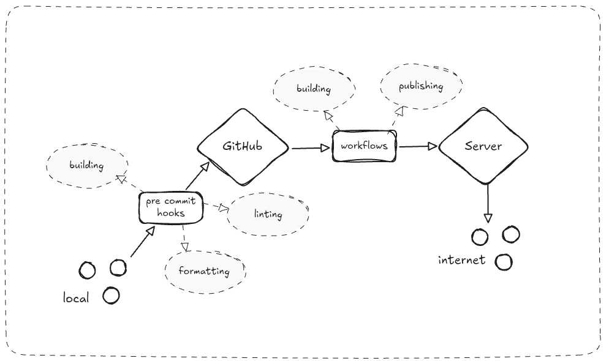

# JanSetu

## Software Pipeline

A **Software Pipeline** describes how a project moves between its stages of publishing from local development. It is important as it gives a clear view as to what all steps a programmers code goes through before it gets **deployed to production**.

### The steps/nodes

1. **Local** : This is the actual development environment of a programmers where they make changes to the software's code.

2. **Pre Commit Hooks** : This is the first check before publishing code to a collaborative environment like *GitHub*. A *pre commit hook*, like its name suggests, runs before running running `git commit` automatically. It is a set of pre set commands that ensure that the code being written follows the standards set for that project. In our case we have three major *pre commit checks*.

	-  **Linting** : This step analyzes the code being added for any *programmatic and stylistic* errors.The programmatic and stylistic rules are preset per project defined generally by a *config file*. This allows one to catch any *known issues* before hand and hence saves debugging time. a good example would be *unused import* where redundant imports increase *software package size* and hence should be removed. **linting changes are manual**

	- **Formatting** : This step auto formats code to the *set standard* that is defined per project via a *config file*. A good example would be *tabs vs spaces*, where some developers prefer using tabs and some prefer spaces but the project to disallow ambiguity only allows *tabs*, and so all "space" code auto converts to tabs before being added. **formatting changes are automatic**

	- **Building** : This step your project is built *locally* so as to find any errors that may cause a *build time error* which if pushed could take down a *deployment*. A good example would be *not using .js after import files* which sometimes the *tsc* typescript compiler fails at during building.

3. **Github** : This is the main hub where your code lives on the cloud which allows for collaboration. *git* is version control, *github* is a cloud platform which powers git by storing code. *git* != *github*

4. **Workflows** : A workflow can be thought of simply as a *pre commit hook* but on the cloud, which also listens to some *event* and then performs some *steps*, automaticaly. In our case we only have like two *major steps*, which have their own *sub steps* but they are a little out of scope here.

	-  **Building** : Here our *entire* project software is built into (in our case) a singular **docker image**. Local building step helps prevent any errors from occurring during our main building step (this one).

	- **Publishing** : Here (in our case) the built *docker image* is published to **docker hub**. Docker hub is (just like github), a cloud storage for all docker images on the web that can be *pulled from*.

5. **Server** : This is a cloud computer where our actual project gets *deployed* from. The entire process of deployment is supported by tools like **docker-compose** and **watch tower**, where *docker compose* manages the structure of a *docker image* and *watch tower* listens to updates for a docker image.

6. **Internet** : Well this is a self explanatory node, this is when our software gets accessible to the users. A lot of pre-processing steps are involved here like, **reverse proxy**, **dns** etc

Every project will have its own *software pipeline*, but the above pipeline can be thought of as the most basic and rudimentary one which powers more complex pipelines.
